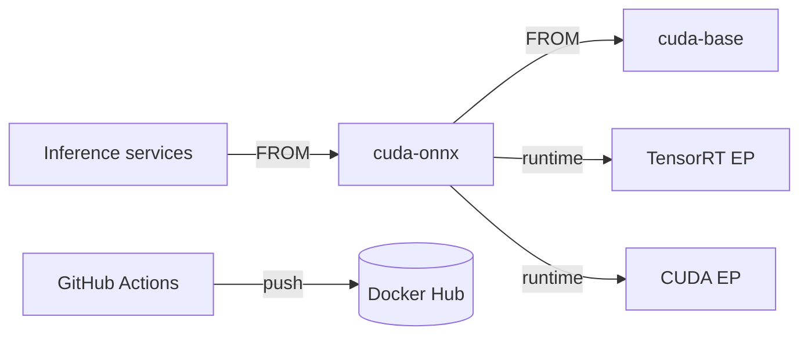

# cuda-onnx

Multi-architecture Docker base image for ONNX Runtime inference with GPU acceleration on the Phystack platform.

[](https://github.com/phystack/cuda-onnx/actions/workflows/docker-build-deploy.yml)
[](https://hub.docker.com/r/phygrid/cuda-onnx/tags)
[](https://hub.docker.com/r/phygrid/cuda-onnx)

## Overview

cuda-onnx extends the `phygrid/cuda-base` image with ONNX Runtime GPU, TensorRT execution provider support, and common computer-vision Python packages. It targets both AMD64 servers and ARM64 NVIDIA Jetson devices, providing a ready-to-use base for ML inference services across the Phystack edge and cloud fleet.

## Architecture



## Tech Stack

| Layer | Technology |
|-------|------------|
| Base image | `phygrid/cuda-base:latest` (Python 3.11, CUDA 12.x, TensorRT 10.13.2) |
| Inference | ONNX Runtime GPU 1.22.0, ONNX 1.19.0 |
| CV libraries | OpenCV (headless), SciPy, Hugging Face Hub |
| Platforms | `linux/amd64`, `linux/arm64` |
| CI/CD | GitHub Actions (self-hosted runner `github1`) |
| Registry | Docker Hub (`phygrid/cuda-onnx`) |

## Prerequisites

- Docker with Buildx (for multi-arch builds)
- NVIDIA GPU drivers and `nvidia-container-toolkit` (for GPU inference at runtime)

## Installation

```bash
docker pull phygrid/cuda-onnx:latest
```

Pin a specific version in downstream Dockerfiles:

```dockerfile
FROM phygrid/cuda-onnx:1.0.24
```

## Usage

### As a base image

```dockerfile
FROM phygrid/cuda-onnx:1.0.24

COPY models/ /app/onnx_models/
RUN pip install --no-cache-dir -r requirements.txt

CMD ["python", "inference_server.py"]
```

### Running with GPU support

```bash
# AMD64 server
docker run -d --gpus all -p 8000:8000 \
  -v /data/models:/app/onnx_models \
  phygrid/cuda-onnx:latest

# ARM64 Jetson
docker run -d --runtime nvidia --gpus all -p 8000:8000 \
  -v /data/models:/app/onnx_models \
  phygrid/cuda-onnx:latest
```

### Python inference example

```python
import onnxruntime as ort
import numpy as np

providers = ["TensorrtExecutionProvider", "CUDAExecutionProvider", "CPUExecutionProvider"]
session = ort.InferenceSession("/app/onnx_models/model.onnx", providers=providers)

input_data = np.random.randn(1, 3, 224, 224).astype(np.float32)
result = session.run(None, {"input": input_data})
```

## Environment Variables

| Variable | Default | Description |
|----------|---------|-------------|
| `OMP_NUM_THREADS` | `4` | OpenMP thread count |
| `ONNX_NUM_THREADS` | `4` | ONNX Runtime intra-op thread count |
| `OPENBLAS_NUM_THREADS` | `4` | OpenBLAS thread count |
| `ORT_TRT_FP16` | `1` | Enable FP16 precision in TensorRT EP |
| `ORT_TRT_ENGINE_CACHE_ENABLE` | `1` | Cache compiled TensorRT engines |
| `ORT_TRT_ENGINE_CACHE_PATH` | `/app/ort_cache` | TensorRT engine cache directory |
| `ORT_TRT_MAX_WORKSPACE_SIZE` | `1073741824` | TensorRT workspace limit (bytes, default 1 GB) |
| `ORT_TRT_BUILDER_OPTIMIZATION_LEVEL` | `3` | TensorRT builder optimization level |

## Project Structure

```
Dockerfile          # Multi-stage build (builder + runtime)
VERSION             # Semver used by CI for tagging
.github/workflows/
  docker-build-deploy.yml   # Build, push, tag, release
LICENSE
```

## Testing

Run the built-in health check to verify the ONNX Runtime setup:

```bash
docker run --rm --gpus all phygrid/cuda-onnx:latest python /app/health_onnx.py
```

The script validates that ONNX, ONNX Runtime, OpenCV, SciPy, and Hugging Face Hub are importable and reports available execution providers (TensorRT, CUDA, CPU).

## Deployment

Pushes to `main` that modify `Dockerfile`, `VERSION`, or the workflow file trigger the [Build and Deploy](https://github.com/phystack/cuda-onnx/actions/workflows/docker-build-deploy.yml) pipeline. The pipeline:

1. Reads `VERSION` and auto-increments the patch number if the tag already exists.
2. Builds multi-arch images (`linux/amd64`, `linux/arm64`) with Buildx.
3. Pushes to Docker Hub as `phygrid/cuda-onnx:<version>` and `phygrid/cuda-onnx:latest`.
4. Creates a GitHub Release and git tag.
5. Syncs this README to the Docker Hub description.

## Publishing

Releases are fully automated. To publish a new version:

- **Patch bump** -- push any change to `Dockerfile` on `main`. The pipeline auto-increments the patch version.
- **Minor/major bump** -- edit the `VERSION` file directly (e.g., `2.0.0`) and push. The pipeline uses the new value as-is.

## Related Documentation

- [phygrid/cuda-base](https://hub.docker.com/r/phygrid/cuda-base) -- upstream base image
- [ONNX Runtime GPU docs](https://onnxruntime.ai/docs/execution-providers/CUDA-ExecutionProvider.html)
- [TensorRT Execution Provider](https://onnxruntime.ai/docs/execution-providers/TensorRT-ExecutionProvider.html)
- [LICENSE](./LICENSE) -- MIT
